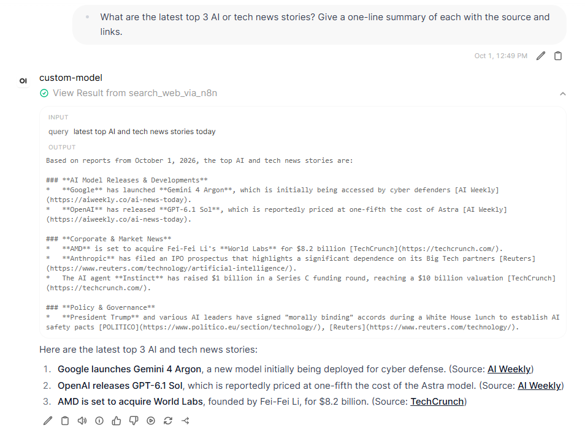
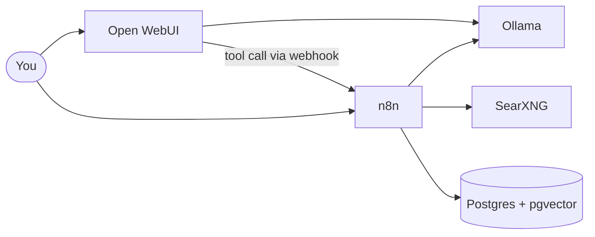
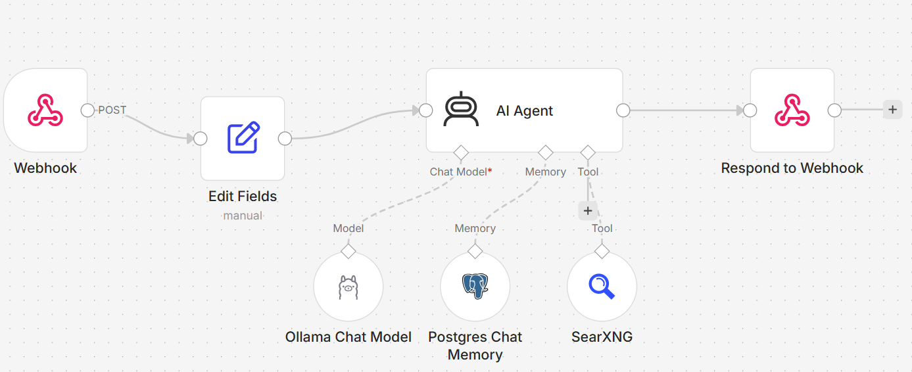

# local-agent-stack

A small, self-hosted stack for building agentic AI workflows with open-source tools. One `docker compose up` gives you a local LLM runtime, a chat UI, a workflow automation engine, a private web search engine and a Postgres database, all wired together, plus a working web-search agent to start from.



## Why this exists

This repo aims to be a small stack that can run a real agent: an LLM runtime, a chat interface, an automation engine that can call tools, a private search tool and a database for memory. Inspired by [coleam00/local-ai-packaged](https://github.com/coleam00/local-ai-packaged), but deliberately smaller. This stack keeps only what one working agent needs, so you can follow the whole workflow, from the chat message to the web search and back.

It includes one working agent (a web-search agent, see [the example](#example-a-web-search-agent)) that runs as is and serves as a base to extend with more tools, more agents, a vector store in the Postgres database, or different models. It is intended as a starting point for agent workflow applications, and serves as the author's own base for future ones.

## What's in the stack

| Service | Role | URL (localhost only) |
|---|---|---|
| [Ollama](https://ollama.com) | Runs LLMs locally | http://localhost:11435 |
| [Open WebUI](https://github.com/open-webui/open-webui) | Chat interface on top of Ollama | http://localhost:3000 |
| [n8n](https://n8n.io) | Workflow automation, where you build the agents | http://localhost:5678 |
| [SearXNG](https://github.com/searxng/searxng) | Private meta search engine, usable as an agent web-search tool | http://localhost:8081 |
| Postgres ([Supabase image](https://github.com/supabase/postgres), with pgvector) | Database for n8n, and vector storage for your own workflows | localhost:54322 |



All ports are bound to `127.0.0.1`, so nothing is exposed to your network by default.

## Requirements

- [Docker](https://docs.docker.com/get-docker/) with Compose v2 (Docker Desktop on Windows or macOS).
- Around 10 GB of free disk space for the images, plus the size of any local models you pull.
- For local models: enough RAM for the model you choose (a small 3B model runs on CPU with about 8 GB of RAM). With [Ollama Cloud](#choosing-models) models you need no GPU and little RAM.

## Quickstart

```bash
git clone https://github.com/pourmoayed/local-agent-stack.git
cd local-agent-stack

cp .env.example .env
# edit .env and set the passwords and secrets (see the file for how to generate them)

docker compose up -d
```

The stack needs a model to talk to. See [Choosing models](#choosing-models) below, then open Open WebUI at http://localhost:3000 and n8n at http://localhost:5678, and create your admin accounts on first visit.

### Run the example agent in five steps

1. Start the stack as above.
2. Get a model: an Ollama Cloud API key (the workflow's default), or a local model with tool calling (`docker exec -it ollama_ai ollama pull llama3.2`).
3. In n8n, import [examples/n8n/ai-agent-search.json](examples/n8n/ai-agent-search.json), create its three credentials (Ollama, Postgres, SearXNG) and activate it. Details: [examples/n8n](examples/n8n/README.md).
4. In Open WebUI, add the tool from [config/open-webui](config/open-webui/README.md) and attach it to a model.
5. Ask that model something that needs current information, and watch it call the agent.

### Choosing models

You can run models in two ways, and mix them freely.

**Local models** run in the `ollama` container and need enough RAM or GPU memory. Pull one, and it appears in Open WebUI automatically and is available to n8n at `http://ollama:11434`:

```bash
docker exec -it ollama_ai ollama pull llama3.2
```

By default the `ollama` container runs on CPU, so stick to small models. To use an NVIDIA GPU, add GPU access to the `ollama` service as described in [Ollama's Docker documentation](https://docs.ollama.com/docker).

**Ollama Cloud models** (for example `gemma4:31b`) run on [ollama.com](https://ollama.com), so they need no local GPU. Create an API key in your Ollama account, then:

- **In Open WebUI:** add an Ollama connection with URL `https://ollama.com` and your API key (*Admin Settings > Connections*; the menu name may vary by version).
- **In n8n:** create the Ollama credential with Base URL `https://ollama.com` and the API key.

Whichever you use, choose a model that supports tool calling if you want it to drive agents or tools.

### Context length

The `ollama` container does not set a context length, so it uses Ollama's built-in default. That has historically been 4096 tokens, and newer Ollama versions may choose a larger default based on available VRAM. A small window fills quickly with search results, and Ollama silently drops the oldest tokens, so an agent can appear to forget what a search returned. If that happens, check the context length first.

To raise it for every request, add `OLLAMA_CONTEXT_LENGTH` to the `environment` section of the `ollama` service in [docker-compose.yml](docker-compose.yml), then recreate the container:

```yaml
  ollama:
    environment:
      - OLLAMA_CONTEXT_LENGTH=16384
```

```bash
docker compose up -d ollama
```

A larger context uses more memory for the KV cache, which slows generation or fails to load if the model no longer fits. Raise it only as far as you need. To see what a loaded model is actually using, run `docker exec -it ollama_ai ollama ps`.

This applies to local models only. Ollama Cloud models run on ollama.com with their own limits.

### Using SearXNG as a search tool

SearXNG is configured to return JSON ([config/searxng/settings.yml](config/searxng/settings.yml)). Inside the compose network, call it at:

```
http://searxng:8080/search?q=<query>&format=json
```

Use this URL from an n8n HTTP Request node, or in Open WebUI under *Admin Settings > Web Search*.

### Smoke-testing Ollama

[misc/test_ollama.py](misc/test_ollama.py) is a stdlib-only script that checks the Ollama container (or Ollama Cloud) is reachable:

```bash
python misc/test_ollama.py --list
python misc/test_ollama.py llama3.2 --stream
python misc/test_ollama.py --cloud --chat     # needs OLLAMA_CLOUD_API_KEY
```

## Example: a web-search agent

The repo includes a working agent that ties the services together: an n8n workflow exposed as a webhook, which an Open WebUI model calls as a tool.



- **[examples/n8n](examples/n8n/README.md):** the importable workflow (AI agent + Ollama model + Postgres chat memory + SearXNG search) and how to set it up.
- **[config/open-webui](config/open-webui/README.md):** the Open WebUI tool that lets a chat model call that workflow, with install steps and troubleshooting.

## Design decisions

- **The agent is a webhook, used as a tool.** The chat model in Open WebUI stays simple and only decides *when* it needs fresh information. The n8n agent does the searching and returns a cited answer. Because the agent sits behind a plain HTTP endpoint, the same workflow can be called from Open WebUI, a script, or another agent.
- **Private, self-hosted search.** SearXNG aggregates several search engines without API keys or per-query costs, and sends queries without your personal account or tracking profile attached.
- **Memory per conversation in Postgres.** Each Open WebUI chat ID becomes an n8n session ID, so every chat has its own history, stored in a database you can query and delete from (see [where the chat memory is stored](examples/n8n/README.md#where-the-chat-memory-is-stored)).
- **Local and cloud models are interchangeable.** Switching between a local model and an Ollama Cloud model is a change of credential and model name, not of code.
- **One database.** The same Postgres instance (with pgvector) stores n8n's own data, the chat memory, and later vector embeddings, which keeps the stack small.

## Roadmap

- Retrieval-augmented generation (RAG) on your own documents, using pgvector in the existing Postgres.
- More tools for the agent, and examples of agents that call each other.
- An agent that turns plain-language requests into structured input for an optimization (operations research) solver, and explains the solver's result.

## Security notes

- Keep `.env` out of version control. It is already in `.gitignore`.
- The default bindings are localhost-only. If you put this on a server, add a reverse proxy with TLS and authentication before exposing anything. Ollama has no authentication of its own.
- The example n8n webhook has no authentication, which is fine on localhost. Before exposing n8n, enable *Header Auth* on the Webhook node, then set the same header name and value in the Open WebUI tool's settings (`auth_header_name` and `auth_header_value`).
- Set strong, unique values for every secret in `.env`.
- Postgres, n8n and Ollama are pinned to specific versions. Open WebUI (`main`) and SearXNG (`latest`) follow upstream, so a fresh pull may differ from what this stack was tested with. Pin them if you need reproducible deployments.

## Related

- [nim-agent-proxy](https://github.com/pourmoayed/nim-agent-proxy): run Codex CLI or Claude Code against free NVIDIA-hosted models through a local LiteLLM proxy.

## Project status

This is an early-stage, personal project. It provides the infrastructure and one example agent. Issues and pull requests are welcome.

## License

The files in this repository are released under the [MIT license](LICENSE).

The services the stack runs (Ollama, Open WebUI, n8n, SearXNG, Postgres) are separate projects with their own licenses. Their images are pulled from the upstream registries, not redistributed here. Check their terms before commercial use.
