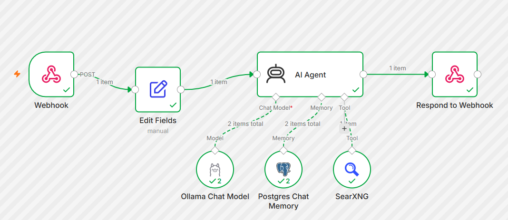

# Example n8n workflow: AI agent with web search

[ai-agent-search.json](ai-agent-search.json) is an importable n8n workflow that exposes a web-searching AI agent as a webhook. Send it a question and a session ID, and it answers using a local Ollama model, searches the web through SearXNG when it needs to, and remembers the conversation in Postgres.

```
Webhook (POST) -> Edit Fields -> AI Agent -> Respond to Webhook
                                   |-- Ollama Chat Model   (the LLM)
                                   |-- Postgres Chat Memory (history, keyed by session_id)
                                   '-- SearXNG             (web search tool)
```


A successful run, with the agent calling the model, memory and SearXNG:



| Node | What it does |
|---|---|
| Webhook | Accepts `POST /webhook/ai-agent-search`. Responds later via the *Respond to Webhook* node. |
| Edit Fields | Maps the request body to the fields the agent expects: `chatInput` (the question) and `session_id`. |
| AI Agent | Decides whether to call the search tool, then writes the answer. |
| Ollama Chat Model | The LLM, on Ollama Cloud by default or on the local `ollama` container. |
| Postgres Chat Memory | Stores chat history in the stack's Postgres, one conversation per `session_id`. |
| SearXNG | Lets the agent search the web through your private SearXNG instance. |
| Respond to Webhook | Returns `{"output": "<answer>"}` as JSON. |

## Setup

1. Start the stack and open n8n at http://localhost:5678 (see the [main README](../../README.md)).
2. Choose where the model runs. The workflow is set to `gemma4:31b` on [Ollama Cloud](https://ollama.com), which needs no local GPU. Create an API key in your Ollama account and use it in the credential in step 4. To run locally instead, pull a model that fits your hardware (`docker exec -it ollama_ai ollama pull <model>`), select it in the **Ollama Chat Model** node, and use the local Base URL in step 4. Either way, pick a model that supports tool calling, or the agent won't be able to use the search tool.
3. Import the workflow, either in the UI (*Workflows > ... > Import from file*, then choose `ai-agent-search.json`), or from the command line:

   ```bash
   docker cp examples/n8n/ai-agent-search.json n8n_automation:/tmp/ai-agent-search.json
   docker exec n8n_automation n8n import:workflow --input=/tmp/ai-agent-search.json
   ```

   Refresh the n8n page afterwards. The workflow is imported inactive, and its credentials still have to be attached in step 4.
4. Create the three credentials. n8n runs inside the compose network, so use container hostnames, not `localhost`:

   | Credential | Setting | Value |
   |---|---|---|
   | Ollama (cloud, default) | Base URL | `https://ollama.com` |
   | | API Key | your Ollama Cloud API key |
   | Ollama (local alternative) | Base URL | `http://ollama:11434` |
   | Postgres | Host | `supabase-db` |
   | | Port | `5432` |
   | | Database | `postgres` |
   | | User | `postgres` |
   | | Password | the `SUPABASE_DB_PASSWORD` from your `.env` |
   | SearXNG | URL | `http://searxng:8080` |

5. **Publish / activate** the workflow. Only an active workflow answers on the production `/webhook/` URL. While testing in the editor, n8n uses `/webhook-test/` instead, and only after you click *Execute workflow*.

## Try it

```bash
curl -X POST http://localhost:5678/webhook/ai-agent-search \
  -H "Content-Type: application/json" \
  -d '{"chat_input": "What is the latest stable Python version?", "session_id": "demo-1"}'
```

Response:

```json
{ "output": "..." }
```

Request fields:

| Field | Description |
|---|---|
| `chat_input` | The user's question. |
| `session_id` | Any string. Requests with the same value share conversation memory. |

## Where the chat memory is stored

The **Postgres Chat Memory** node writes every message to a table called `n8n_chat_histories` in the stack's Postgres database. n8n creates the table itself on the first request.

| Column | Type | Content |
|---|---|---|
| `id` | integer | Auto-incrementing row ID. Order by it to replay a conversation. |
| `session_id` | varchar | The `session_id` from the request. Open WebUI sends its chat ID here. |
| `message` | jsonb | One message: `type` (`human`, `ai` or `tool`), `content`, and for `ai` messages that call a tool, `tool_calls`. |

A single question produces several rows: the `human` question, an `ai` row with empty content and `tool_calls` (the agent decided to search), a `tool` row with the SearXNG results, and the final `ai` answer.

Read a conversation from the command line:

```bash
docker exec supabase_postgres psql -U postgres -c \
  "select id, message->>'type' as type, left(message->>'content', 80) as content
   from n8n_chat_histories where session_id = 'demo-1' order by id;"
```

To browse it in a GUI such as DBeaver, connect to host `localhost`, port `54322`, database `postgres`, user `postgres`, and the `SUPABASE_DB_PASSWORD` from your `.env`.

Chat histories contain your questions and the search results in plain text and stay until you delete them. To forget one conversation:

```bash
docker exec supabase_postgres psql -U postgres -c \
  "delete from n8n_chat_histories where session_id = 'demo-1';"
```

## Use it from Open WebUI

[config/open-webui/tool-n8n-connection.py](../../config/open-webui/tool-n8n-connection.py) is an Open WebUI tool that calls this webhook, so a chat model can delegate web searches to the agent.

## Notes

- The **AI Agent** node has a system prompt (*Options > System Message*) that tells it to search, stay grounded in the results, and cite source URLs. Edit it to change the agent's behavior.
- The exported workflow contains no secrets, and credentials are not included. You must create them yourself as described above.
